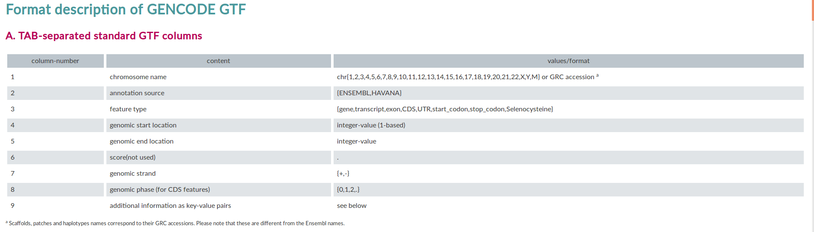

# File Formats

## GTF

1. The Gene transfer format (GTF) is a file format used to hold information about gene structure. It is a tab-delimited text format based on the general feature format (GFF), but contains some additional conventions specific to gene information. A significant feature of the GTF that can be validated: given a sequence and a GTF file, one can check that the format is correct. This significantly reduces problems with the interchange of data between groups. [Source](https://en.wikipedia.org/wiki/Gene_transfer_format)

   

   

