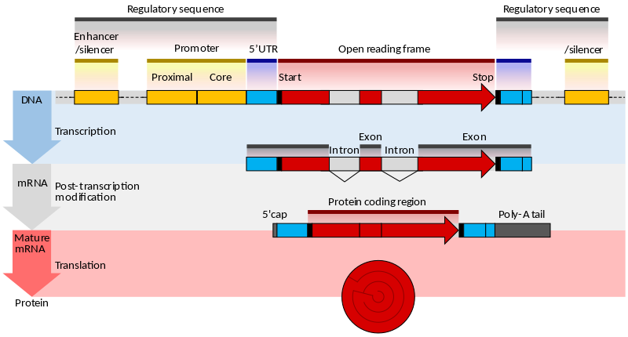

# Glossary

##  Spike In

Used primarily in RNA differential expression quantification using RNA-Seq/Microarray. It involved adding a known transcript in known concentrations so that the analysis can be standardised/tested.

## CGI-TCGA-TARGET  FET Score

a score derived from a statistical test— **Fisher’s Exact Test (FET)** — that states the likelihood that the variant is somatic given the observed read counts in the tumor and normal samples. The score is transformed from the fractional-value result of the test to a Phred-scaled integer. This score is present only for variants with the “SS=Somatic” tag, and is named “CGA_SOMFE.” 
In the  case of a somatic call, a lower-value  indicates that the DNB counts are less likely  to be random  or more likely to represent a somatic variant. Alternatively, a higher-value  would correspond  to a germline  variant or maybe a false positive call in the tumor, where the DNB counts  supporting reference and variant seem to be randomly assigned to the tumor or normal

## CDS

The coding region of a gene, also known as the CDS (from coding sequence), is that portion of a gene's DNA or RNA that codes for protein. The region usually begins at the 5' end by a start codon and ends at the 3' end with a stop codon. 

The coding region in an mRNA is flanked by the five prime untranslated region (5'-UTR) and the three prime untranslated region (3'-UTR). The CDS is that portion of an mRNA transcript that is translated by a ribosome.

A cDNA sequence is derived from the transcript by reverse transcription, but in this case it also contains the 5' and 3' UTRs, which are not part of the CDS (they are transcribed, but not translated). A CDS will almost always start with an AUG initiation codon in eukaryotes and stop at one of the three stop codons (UAA, UGA, UAG). [Source](https://en.wikipedia.org/wiki/Coding_region)

## Eukaryotic Gene Structure

[Source](http://carolguze.com/text/442-1-humangenome.shtml)

