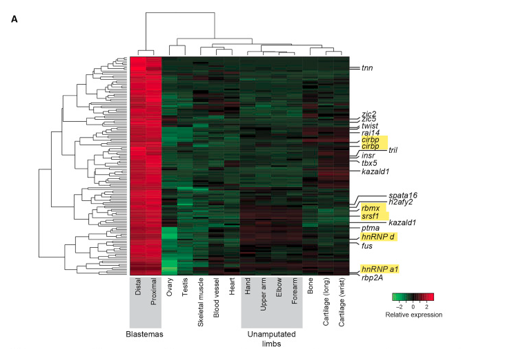

# Complex Heatmap

1. Adding row annotations only for a few select genes like this :point_down:

    

[Soruce1]() [Source2](https://www.biostars.org/p/258462/#258536)

You basically add it as a row annotation. The type of row annotation added is row_anno_link. This takes the positons and the labels as arguments. And thats about it. Below is the snippet for the vignette

```R
mat = matrix(rnorm(10000), nr = 1000)
rownames(mat) = sprintf("%.2f", rowMeans(mat))
subset = sample(1000, 20)
labels = rownames(mat)[subset]
Heatmap(mat, show_row_names = FALSE, show_row_dend = FALSE, show_column_dend = FALSE) + 
rowAnnotation(link = row_anno_link(at = subset, labels = labels),
  width = unit(1, "cm") + max_text_width(labels))
```

[Source](https://bioconductor.org/packages/release/bioc/vignettes/ComplexHeatmap/inst/doc/s4.heatmap_annotation.html#toc_5)

