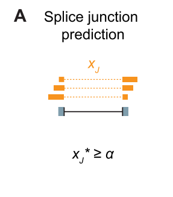
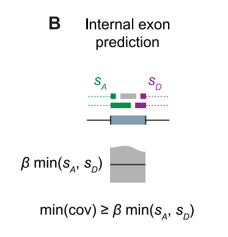
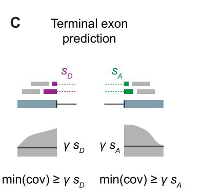

# SGSeq

## Notes from the [publication](https://journals.plos.org/plosone/article?id=10.1371/journal.pone.0156132)
1. Transcript variants can lead to protein isoforms with distinct function, changed UTRs with altered regulatory potential, or nonfunctional transcripts that are subject to nonsense-mediated decay (NMD).
2. For the annotation-free analysis of splice events, we predict exons and splice junctions from RNA-seq reads previously mapped to a reference genome, and assemble them into a genome-wide splice graph. Splice events are identified from the graph and are quantified locally based on reads that extend across the start or end of each splice variant.
3. Initially splice junctions are extracted from split read alignments. The identified splice junctions are filtered based on their normalized count in FPKM units, controlled by parameter α

   Splice junctions implied by split read alignments are filtered based on read counts in FPKM units. α is Minimum required fragment count in FPKM units

4. Genomic regions flanked by a splice acceptor and a splice donor are candidate inter- nal exons and are filtered based on their coverage with structurally compatible reads, controlled by parameter β

   

   Genomic regions flanked by identified introns are predicted as internal exons if the minimum compatible coverage is at least β times the number of reads supporting the spliced exon boundaries.

5. Genomic regions characterized by an intron on one side and a drop of coverage on the other side are predicted as terminal exons, controlled by parameter γ

   

   Genomic regions characterized by a flanking intron on one side and drop of coverage on the other side are predicted as terminal exons, with exon coordinates determined by the maximal region with compatible coverage at least γ times the number of reads supporting the spliced exon boundary.

6. There is a lot of usage for FluxSimulator for RNA-Seq simulation.

