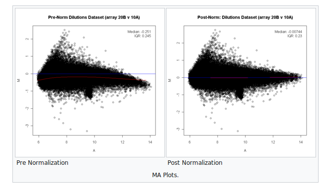

# STAT 115

## Week1 

### Thurs Lect

#### Microarray Normalization

1. **MA plot** is a plot of fold change vs mean expression. It stands for M(log ratio) and A(mean average). It can be very handy to inspect the MA plot to check if your normalization has worked for microarray. An example of how the data looks before and after normalization can be seen below

[Source](https://en.wikipedia.org/wiki/MA_plot)

It can also be used in RNA seq to see the effect of shrinkage. So you expect most of the genes to be near 0 and only a few outliers. So here when you do a LOWESS(the red line) which is kinda like the trend capturing line you expect it to closely overlap with the blue one. You can see that it happens in the case of post normalization.

2. **LOWESS** - It stands for LOcally WEighted Scatterplot Smoothing. Is a way of capturing the trend by averaging locally. So it will take a average kind for a small part in the start and make a linear line capturing this trend. When you make a lot of these linear lines you get a curve which captures the trend.