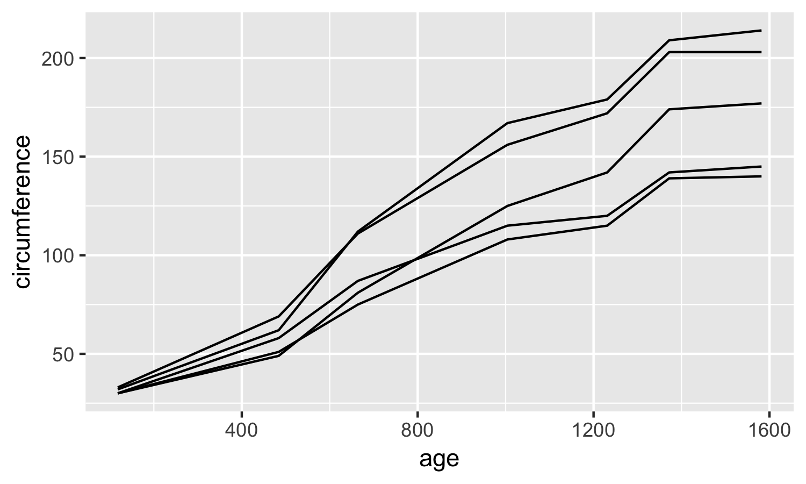

# GGPLOT2

1. If you want a plot with a square aspect ratio in ggplot2 you can get by adding setting aspect.ratio as 1 in theme. e.g `ggplot() + theme(aspect.ratio=1)`. [Source](https://stackoverflow.com/a/35912397)

2. The theme addons i.e. [ggsci](https://nanx.me/ggsci/articles/ggsci.html), [ggtech](https://github.com/ricardo-bion/ggtech), [ggthemes](https://github.com/jrnold/ggthemes)can give you multiple options colour palletes to choose from

3. You can browse a wide variety of addons at - [ggplot2-exts](www.ggplot2-exts.org/gallery/)

4. For any geom if you add an aesthetic besides x,y inside aes() then it used for mapping with a factor variable or the contrary you can set it to a fixed value by specifying it outside aes e.g.

```R
# This is colour as per the values of factor1 column
ggplot2(aes(x = axis1, y = axis2)) + geom_point(aes(color = factor1)) 
# This will make all the points of the colour red
ggplot2(aes(x = axis1, y = axis2)) + geom_point(color = factor1) 
```
[Source](https://r4ds.had.co.nz/data-visualisation.html#aesthetic-mappings)

5. A good reference for [violin plots](http://www.sthda.com/english/wiki/ggplot2-violin-plot-quick-start-guide-r-software-and-data-visualization).

6. A good way of adding labels to your points/objects on the plot is to use ggrepel

7. If you export a figure created using ggplot2 (using RStudio: Export -> Copy to Clipboard) and load it into a graphics editor you can select and edit each individual aspect of the figure, including text. #TODO - I need to still text this [Source](https://stackoverflow.com/a/40149093)

## AES

1. **group** - Group is a cool aesthetic which helps you break down one variable as per the values for another one.  An example is here

   

   This plot is created using

   ```R
   ggplot(Orange) +
       geom_line(aes(x = age, y = circumference, group = Tree))
   ```

   What this is doing is breaking down age into 5 groups as per Trees. [Source](https://michaeltoth.me/a-detailed-guide-to-plotting-line-graphs-in-r-using-ggplot-geom_line.html)

   

## Companion Packages

### [Cowplot](https://cran.r-project.org/web/packages/cowplot/vignettes/introduction.html)

Cowplot is a handy themer for ggplot2. I myself personally dont like its output but it seems to be more cleaner and acceptable for publications

1. If you want to change the axis line size once you have loaded cowplot you cannot do it the normal way i.e changing properties of `axis_line` in theme section you have to do it in the function `theme_cowplot` and change the attribute `line_size` in it. e.g `theme_cowplot(line_size = 0.8)`

   