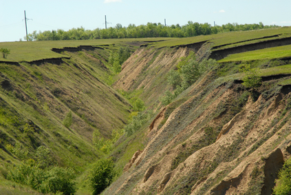

​	

## Resources

- [Salient aspects of the problem of dacoity in chambal valley](http://shodhganga.inflibnet.ac.in/handle/10603/36326)
- [SOCIAL   DIFFERENTIATION   IN   VICTIMISATION   BY   DACOIT-GANGS   IN  THE  CHAMBAL  VALLEY](http://ijsw.tiss.edu/greenstone/collect/ijsw/index/assoc/HASH019e/352d7611.dir/doc.pdf)

M.Z.Khan has done on lot of research on this topic

1. **Ravines** - It is a landform that is narrower than a canyon but larger than gullies. It is formed due to erosion from flow of a stream/river.

[Source](https://en.wikipedia.org/wiki/Ravine)

[Source]()

