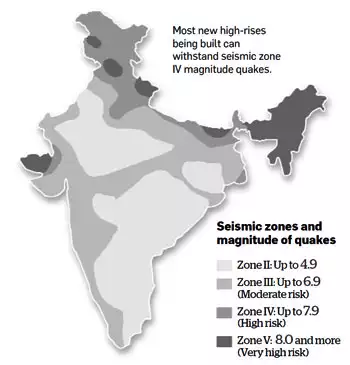

## Low vs High flat in Buildings

### Resources

1. [IndianRealEstate Foum Discussion 1](https://www.indianrealestateforum.com/forum/city-forums/ncr-real-estate/noida-real-estate/14490-high-floors-and-low-floors-premium-opposite-thinking-to-mumbai/page6?t=16754)
2. [Economic Time Article](https://economictimes.indiatimes.com/realty-trends/residential-skyscrapers-is-high-rise-living-for-you/articleshow/7742536.cms?curpg=1)

## Points against Higher floors

1. Earthquake not so much of a problem but fire is for sure.
2. Lift takes time for higher floors and you will be lazy to go down for chores.
3. Check if you can use lifts of another tower so that there is atleast a backup
4. Check if you can get a grill fitted in the balcony.
5. Check the lifts to flat ratio
6. The builder should be good
7. Insurance can be costly

## Earthquake risk zones India

